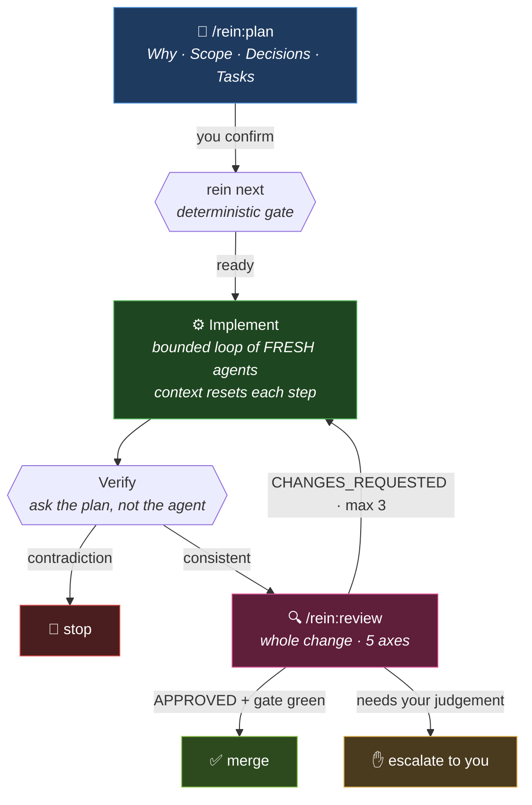

<div align="center">

# 🐎 Rein

**Keep your Claude Code agents lean and in control.**

A Claude Code plugin that turns agent work into a bounded, measured, independently-reviewed flow —
and tells you what it actually cost, per model.

[](LICENSE)
[](https://github.com/luisfarfan/rein-agentic-kit/actions/workflows/ci.yml)
[](#)
[](#)
[](https://claude.com/claude-code)

</div>

---

## 💸 The problem, measured

Optimizing agent cost by "making the model write less" does nothing. Over real Claude Code
transcripts:

| Where the tokens go | Share |
|---|---:|
| 🔴 `cache_read` — context re-read **every turn** | **~90%** |
| 🟠 `cache_write` | ~10% |
| 🟢 **output** — what a compressor would attack | **~0.3%** |
| ⚪ fresh input | ~0% |

**Cost ≈ turns × context size.** One agent that ran 241 turns, re-reading ~234k of context on
every single turn, was most of a 112M-token run.

And Claude Code has **no native eviction of stale tool results** — only `/compact`, which is
lossy and breaks the prompt cache. A long agent's context only grows.

> **Measured effect of this kit: 241 turns → 26 · Opus 100% → 0% · ~7× less context per turn.**

---

## 🔁 The flow



Three roles, and **no agent approves its own implementation**. Every run works in its own git
worktree; unapproved work is never merged.

---

## 🚀 Quickstart

```bash
claude plugin marketplace add luisfarfan/rein-agentic-kit
```

```bash
claude plugin install rein@rein-agentic-kit --scope user
```

```bash
rein doctor
```

`doctor` tells you the detected stack, the resolved commands, and where each one came from.
**If it got everything right, you configure nothing.**

Then, per change:

```
/rein:plan   →   you confirm the plan   →   /rein:loop   →   read the verdict
```

You come back when it finished, not before.

---

## 🧰 What you get

### Skills — the three roles

| | |
|---|---|
| 🎭 **`/rein:role`** | Assign this session's role: planner · implementer · reviewer |
| 🧭 **`/rein:plan`** | Plan into verifiable tasks — dry-run and **explicit confirmation** before writing |
| 🔨 **`/rein:run`** | Exactly **one** task. Max 3 attempts, max 5 failed commands, no self-approval |
| 🔁 **`/rein:run-auto`** | Bounded loop of `run`, stopping on **verifiable signals** only |
| 🔍 **`/rein:review`** | The independent gate: mechanical checks first, then five-axis judgement |
| ♾️ **`/rein:loop`** | Runs all three end-to-end in an isolated worktree |

### CLI — the deterministic half

```bash
rein detect      # stack + commands, with the source of each
rein tasks       # the plan, parsed
rein context     # detect + plan in ONE round-trip — what the loop's first agent runs
rein verify      # actually RUN each resolved command and report the truth — an inference is not a fact
rein next        # ✅ the gate: is there a task to claim, and may it be
rein close T001  # tick a checkbox deterministically — no agent hand-edits the plan
rein review      # record / check a verdict bound to a code state
rein token-report# what a run really cost, per agent and per model
rein ledger      # history across projects, with deltas vs a marked baseline
rein baseline    # mark the run everything is compared against
rein dashboard   # 📊 serve it all as a local page
```

> **The rule that separates them:** if it's a *parse*, a script does it. If it's a *judgement*,
> an agent does it. Every fact an agent doesn't have to rediscover is turns you don't pay for.

---

## ⚖️ The three levers

**1️⃣ Bounded loop of fresh agents.** Each task is at most *N* short, fresh agents handing off a
**compact ledger** (`progress` / `remaining` / `filesTouched` / `verification`) — never one agent
running 200+ turns. Context **resets at every boundary**, so spend stops growing without a ceiling.

**2️⃣ Per-agent model routing.** Mechanical → Haiku · code → Sonnet · the review gate → Opus. On a
subscription this doesn't lower the bill — it frees the **scarce Opus quota**, which is the limit
you actually hit.

**3️⃣ Verifiable signals, not model judgement.** A loop that stops when the model *feels* finished
has no gate. `rein next` answers "is there work to claim" from the plan; `rein review check`
answers "does this approval still apply" from content hashes. Neither asks a model anything.

### ❌ Deliberately not included

Tried and discarded **with data**, not taste:

- **Output compressors** — they attack the 0.3%.
- **Multi-provider API swarms** — the saving doesn't apply on a subscription, and more agents means
  more contexts re-read.
- **Cross-session memory tools** — orthogonal to the actual cost driver.
- **Cache-aware proxies** — no-op on already-cached traffic.
- **Persona prompts** ("you are a hexagonal architecture expert") — the same model with the same
  weights. Constraints that can be *violated* are useful; job titles are not.

---

## ⚙️ Configure

Everything is optional. Drop a `flow.config.json` at your project root to override:

```json
{
  "commands": {
    "test": "uv run pytest -q",
    "testOne": "uv run pytest -q {target}",
    "lint": "uv run ruff check .",
    "typecheck": "uv run mypy ."
  },
  "models": { "aux": "haiku", "impl": "sonnet", "review": "opus" },
  "limits": { "maxTaskSteps": 8, "maxReviewRounds": 3 }
}
```

**Precedence:** `flow.config.json` › task runner (`justfile` / `Makefile` / `Taskfile`) ›
autodetection. A project that already declares how it is built is never second-guessed.

## 🧱 Supported stacks

| Stack | Detected by | Verification |
|---|---|---|
| 🐍 Python | `pyproject.toml`, uv / poetry | pytest · ruff · mypy |
| 🟨 Node / TS | `package.json`, pnpm / npm / yarn / bun | vitest or jest · eslint · tsc |
| 🦀 Rust | `Cargo.toml` | cargo test · clippy · check |
| 🐹 Go | `go.mod` | go test · vet |
| 🎨 **Frontend** *(Next, Vite, Astro, SvelteKit, Nuxt, Remix)* | dependencies | **rendered verification** — unit tests alone don't catch "the tests pass but the UI is broken" |
| ☁️ Serverless / infra | `serverless.yml`, `sst.config.ts`, `*.tf` | `plan` / `validate` — **never deploy** |

Optional tools (`serena`, `graphify`, `openspec`) are **probed, never required**: if one is
absent the flow degrades, it does not break. `rein setup` reports what is missing and
installs it on request — and distinguishes *installed* from *usable*, because graphify
without an index and a just-registered MCP server are both present and inert.

> **No retrieval speedup is claimed.** `serena get_symbols_overview` maps a 697-line file
> in 178 tokens where reading it costs 7,097 — 40× per call, measured. Whether that reduces
> the turns an agent spends orienting is **unmeasured**, and the one control available points
> the other way. See [docs/decisions.md](docs/decisions.md) D2.

## 📊 Measure

```bash
rein token-report && rein dashboard
```

Reads Claude Code's own JSONL transcripts (including `cache_read`) and breaks a run down per
agent and **per model**. Every run is summarized into `~/.claude/rein/runs.jsonl`, so history
survives transcript rotation.

**On the word "savings":** this measures *consumption*. A saving needs a baseline. Mark one with
`rein baseline mark` and every later run in that project gets a signed delta. Without one, the
honest numbers are the three that predict cost — **turns/agent**, **ctx_max/turn**,
**% of tokens on Opus**.

---

## 🙃 Honest limitations

Things a README usually hides:

- **The reviewer is calibrated hard.** 4 of 6 runs here exhausted their 3 rounds. A three-task
  change will often use them all.
- **A stalled agent burns wall-clock.** One run spent 3.4 hours almost entirely in silent API
  retries.
- **`discover` was considered and rejected** — a per-run version of it was measured in the origin
  project and did not move the needle. See [docs/decisions.md](docs/decisions.md).

## 🗺️ Roadmap

| Phase | Scope | |
|---|---|---|
| 0 | Plugin plumbing · `token-report` · ledger · stack detection | ✅ [findings](docs/phase-0-findings.md) |
| 1 | Config-driven core loop · `tasks.md` adapter — **measured** | ✅ |
| 2 | Stack-aware verification policy | ✅ |
| 3 | Local dashboard · per-agent model config | ✅ |
| 4 | Compose real browser verification | ✅ |
| 5 | Docs · polish · a second real-world project | ⏳ |

## 📄 License

MIT — see [LICENSE](LICENSE).

<div align="center">
<sub>Built with Claude Code, reviewed by an agent that wrote none of it.</sub>
</div>
